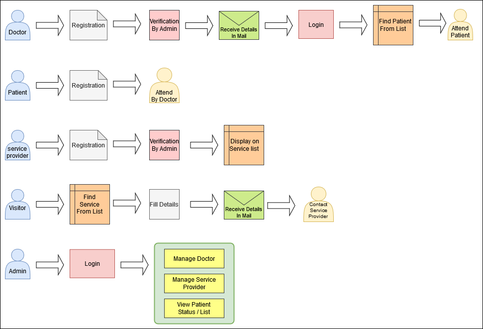
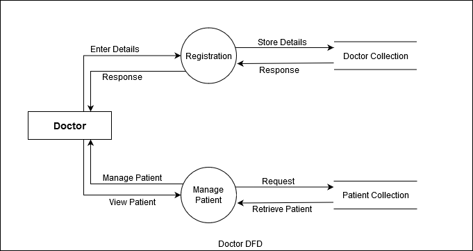
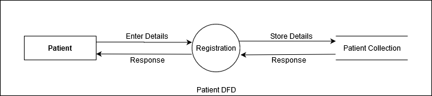
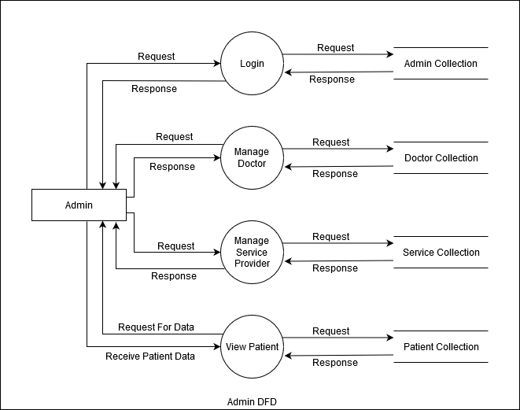

# covid19Help
  Nowadays the number of corona patients increased rapidly. In this situation, the health of a citizen is the most important. In the fight against COVID-19 India need a team of doctors and contributor who are ready to help the citizen.

  On this platform doctors and service providers register with required details. Our team verifies them and allow to help those who need help.

  Those citizens who need medical help fill details about him/her. Verify doctors check patient's details and contact them as soon as early possible.

  Those citizen looking for any service like groceries, vegetables, etc. they can find details of the appropriate service provider and take benefits of them's service.
  
  
<h3>Software use for development</h4>
  <ul>
  <li>NodeJS</li>
  <li>ExpressJS</li>
  <li>MongoDB (Database)</li>
  <li>PugJs (Template engine)</li>
  </ul>
  
  <h2>Process Flow</h2>
  
<h4>How to help as a Doctor?</h4>
  <ol class="lead">
    <li>Fill the details</li>
    <li>If your details verify then you get login details in Email.</li>
    <li>Login as a Doctor</li>
    <li>Find the Patient as per details.</li>
    <li>Contact digitally to the patient.</li>
  </ol>
  
  <h4>How to contact with a Doctor?</h4>
  <ol>
    <li>Fill appropriate details of your disease</li>
    <li>As per your details, doctors will contact you.</li>
  </ol>
  
  <h4>How to register as a Service Provider?</h4>
  <ol>
    <li>Fill the details about your service</li>
    <li>After verifying your details it will show</li>
    <li>Anyone who needs your service we will send contact details.</li>
    <li>They will contact you.</li>
  </ol>
  
  <h4>How to find Service Provider</h4>
  <ol>
    <li>Find Service provider from </li>
    <li>Get contact details.</li>
    <li>Contact them and ask for help.</li>
  </ol>

<h2>Data Flow Diagram</h2>
  
  
  
  
  
  
